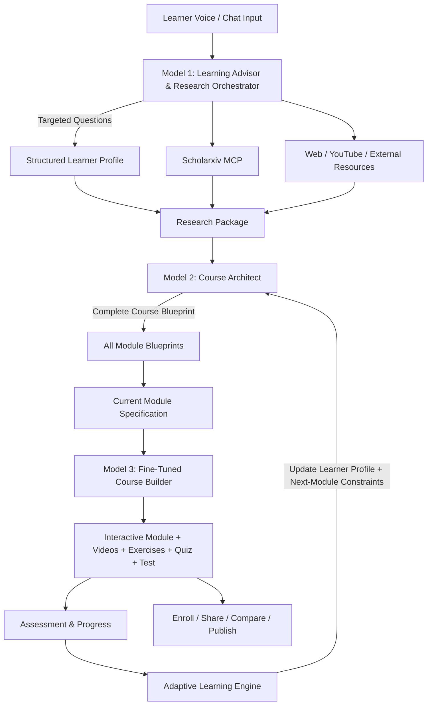

# IFA (AI Learning Companion) - Hackathon-Winning Implementation Plan (v2.0)

> **Hackathon**: STARK Official Hackathon 2026  
> **Team**: Team XOR (Nathnel Teklemariam — Team Lead, Ermiyas Eshetu, Negede Tekleyes)  
> **Target UI**: IFA Dashboard Mockup (`ifa.png`)  
> **Frontend Architecture**: SvelteKit 2 + Tailwind CSS + Lucide Icons  
> **Backend Architecture**: ASP.NET Core 8 / Clean (Onion) Architecture + PostgreSQL  
> **AI Architecture**: Three-Model Adaptive Learning Pipeline (Learning Advisor & Research Orchestrator + Course Architect + Fine-Tuned Course Builder) with an application-level Adaptive Learning Engine  
> **Free-Tier AI Resources**: Google Gemini 2.0/1.5 Flash (Free Tier) + Groq (Llama 3.3) + Google AI Studio Free Fine-Tuning  
> **Mandatory Tooling**: Scholarxiv (Research MCP), Voxide (Voice Engine), EthioDeploy (Deployment), STARK Changelog (Traceability)

---

## 1. Executive Summary & Strategic Validation

IFA is a **personalized, adaptive learning platform** built around a three-model AI pipeline and Just-In-Time (JIT) generation.

1. **Model 1 — Learning Advisor & Research Orchestrator**:
   - Holds the initial conversation with the learner.
   - Asks targeted questions to understand current level, goal, constraints, study time, learning preferences, language, and preferred YouTube creators/channels.
   - Converts the conversation into a structured learner profile.
   - Uses **Scholarxiv MCP** for academic research and the internet for external information, educational resources, documentation, and relevant video links.
   - Produces a grounded **Research Package** containing learner context, research findings, learning objectives, recommended sequence, and curated external resources.

2. **Model 2 — Course Architect**:
   - Receives the learner profile and Research Package.
   - Designs the complete personalized course blueprint: all modules, objectives, topic sequence, resources, assessment strategy, and adaptation points.
   - Does **not** fully generate every module immediately.
   - Materializes the detailed specification for the current module while keeping future modules as lightweight blueprints.
   - This avoids spending compute and free-tier tokens generating content the learner may never reach.

3. **Model 3 — Fine-Tuned Course Builder**:
   - Receives the structured specification for the current module.
   - Converts it into IFA's standardized learner-facing format: lessons, explanations, examples, exercises, embedded resources, quizzes, and module tests.
   - The fine-tuned model specializes in consistent course construction rather than learner profiling or open-ended research.

4. **Adaptive Learning Engine**:
   - This is application logic, not necessarily another model.
   - Tracks quiz/test performance, skill gaps, completion, and learner feedback.
   - Updates the learner profile and informs Model 2 how the next module should adapt.
   - The cycle repeats only when the learner is ready for the next module.

5. **JIT / Lazy Generation**:
   - The system designs the entire learning path but only generates the content needed now.
   - Module 1 is generated first. When the learner completes it, assessment results influence the next module before Model 2 materializes it and Model 3 constructs it.
   - This reduces unnecessary generation, latency, and free-tier resource consumption.

6. **Scholarxiv + Web Grounding**:
   - Academic evidence comes through **Scholarxiv**, while web research can supply current documentation, tutorials, and video resources.
   - User-selected YouTube channels are treated as learning-resource preferences and searched for relevant material rather than blindly inserted.

7. **Social Learning Loop**:
   - Users can enroll, share courses, compare progress with people they invite, and publish suitable courses to the public course area.
   - These features sit on top of the personalized generation pipeline.



## 2. Architectural Blueprint

### 2.1 Three-Model Adaptive Learning Pipeline

```mermaid
sequenceDiagram
    autonumber
    participant U as Learner (Voice / SvelteKit Chat)
    participant M1 as Model 1: Learning Advisor + Research
    participant S as Scholarxiv MCP
    participant W as Web / YouTube Research
    participant M2 as Model 2: Course Architect
    participant M3 as Model 3: Fine-Tuned Course Builder
    participant DB as PostgreSQL / Application
    participant A as Adaptive Learning Engine

    U->>M1: "I want to learn Python for Data Science"
    M1-->>U: "What is your current experience, goal, weekly time, and preferred learning resources?"
    U->>M1: "I'm a beginner, 5 hours/week, job-focused. I like FreeCodeCamp and sentdex."
    M1->>S: Research academic sources and relevant concepts
    M1->>W: Search external resources, documentation and preferred YouTube channels
    S-->>M1: Papers, abstracts, evidence and concepts
    W-->>M1: Curated resource and video metadata
    M1->>M1: Build Learner Profile + Research Package
    M1->>M2: Learner Profile + Research Package
    M2->>M2: Design complete course blueprint
    M2-->>U: Show course roadmap for approval
    U->>M2: "Looks good, start."
    M2->>M2: Materialize Module 1 specification; keep future modules as blueprints
    M2->>M3: Module 1 specification + resources + learner context
    M3-->>DB: Construct Module 1: lessons, exercises, videos, quiz and test
    DB-->>U: Learner starts Module 1
    U->>A: Submit quiz/test
    A->>DB: Update progress and skill gaps
    A->>M2: Send adaptation constraints for next module
    M2->>M3: Materialize next module when needed
```

## 3. UI Alignment with Provided Design (`ifa.png`)

The new features integrate naturally into the existing visual layout:

| UI Component in `ifa.png` | Standard View | New Social & JIT Capabilities |
| :--- | :--- | :--- |
| **Hero Prompt Area** | "What do you want to learn today?" | Conversational scoping with interactive pipeline preview card and inline edit chips. |
| **Explore Public Courses** | Static grid of 4 courses | **Community Marketplace**: Lists community-published AI courses with tags (`Bestseller`, `Trending`), creator badges, and "Publish My Course" button. |
| **Continue Your Learning** | C# Backend Dev (Module 3 of 6) | Shows active module with JIT status (`Module 3 Ready • Module 4 queued`), with "Share with Friend" and "Compare Progress" actions. |
| **Right Sidebar / Donut Chart** | 72% Overall Progress | **Peer Comparison Toggle**: Switch between personal view and "Compare with Ermiyas (78% vs 64%)" with head-to-head skill bars. |
| **AI Tutor Dock** | Floating Chat & Glowing Orb | Orchestrator modal capable of video recommendations, lesson deep-dives, and real-time voice prompts via Voxide. |

---

## 4. Three-Model AI Strategy & Fine-Tuning

IFA uses **three model roles**, with the third model being the specialized fine-tuned component.

### Model 1 — Learning Advisor & Research Orchestrator

**Purpose:** Understand the learner and gather evidence.

Responsibilities:
- Conduct conversational intake through chat or Voxide voice interaction.
- Ask context-aware questions rather than forcing the learner through a long form.
- Capture goal, current level, prior knowledge, constraints, available study time, preferred learning style/language, and preferred YouTube creators/channels.
- Query Scholarxiv through MCP for academic evidence and relevant concepts.
- Search the web for external information, documentation, tutorials, and video resources.
- Produce a structured Learner Profile and Research Package.

### Model 2 — Course Architect

**Purpose:** Turn learner context and research into a complete personalized learning architecture.

Input:

`Learner Profile + Research Package + available resources`

Responsibilities:
- Determine learning objectives and prerequisite relationships.
- Design the complete module sequence.
- Define topics, lesson objectives, resources, practical activities, quizzes and tests for each module.
- Preserve relevant learner-preferred resources.
- Keep future modules as lightweight blueprints rather than fully generated content.
- Materialize the current module specification only when it is needed.
- Incorporate assessment results from previous modules when preparing the next module.

Example:

```json
{
  "course_title": "Backend Development with C#",
  "modules": [
    {
      "module_number": 1,
      "title": "C# & Backend Foundations",
      "status": "READY_FOR_GENERATION"
    },
    {
      "module_number": 2,
      "title": "HTTP & REST APIs",
      "status": "BLUEPRINT"
    }
  ]
}
```

### Model 3 — Fine-Tuned IFA Course Builder

**Purpose:** Convert a materialized module specification into the final learner-facing IFA learning experience.

This model is trained specifically on the **IFA Course Design System**. It should not decide the learner's entire curriculum or perform open-ended research. Its job is controlled course construction.

Input:

```json
{
  "module_number": 1,
  "topic": "REST APIs with ASP.NET Core",
  "target_audience": "College student",
  "learner_profile": {},
  "learning_objectives": [],
  "research_findings": [],
  "resources": [],
  "preferred_videos": []
}
```

Output: Strict JSON including:
- `lesson_title`: Pedagogical title.
- `reading_time_minutes`: Estimated time.
- `video_resource`: Embedded video metadata.
- `content_markdown`: Structured explanations, examples, analogies and code blocks.
- `practical_exercises`: Hands-on activities appropriate to the learner.
- `formative_quiz`: 3-5 questions with explanations and distractor rationales.
- `module_test`: End-of-module assessment.
- `key_takeaways`: Summary of essential concepts.

### JIT / Lazy Generation Strategy

The important optimization is that **designing the course and generating the course are different operations**.

Model 2 can design the complete course path, but IFA does not ask Model 3 to generate every module immediately.

Instead:

`Complete Course Blueprint → Materialize Current Module → Fine-Tuned Model → Learner`

When Module 1 is completed:

`Assessment → Adaptive Learning Engine → Updated Learner State → Model 2 → Module 2 Specification → Model 3 → Module 2`

This means compute is spent on content the learner is actually ready to consume.

### Free-Tier Fine-Tuning Execution

- **Platform**: Google AI Studio Tuned Models / selected compatible free-tier fine-tuning option.
- **Dataset Generation**: Curated JSONL pairs generated with a seed script following the IFA Course Design System and relevant curriculum standards.
- **Fallback**: If the fine-tuned endpoint is unavailable, the system falls back to a few-shot prompted Gemini Flash with strict JSON Schema output.

### Model Boundaries

| Model | Main responsibility | Explicitly not responsible for |
| :--- | :--- | :--- |
| **Model 1** | Understand learner + research evidence/resources | Final course construction |
| **Model 2** | Design complete learning architecture + current module specification | Learner-facing course formatting |
| **Model 3** | Construct the final current module | Open-ended learner profiling/research |
| **Adaptive Engine** | Measure results + update next-generation constraints | Open-ended curriculum research |

This separation keeps the AI pipeline explainable, testable and resource-efficient.

## 5. Development Phases & Pull Request Breakdown

The project is structured into **6 logical phases** and **20 actionable Pull Requests**:

```mermaid
gantt
    title IFA Hackathon Implementation Timeline (v2.0)
    dateFormat  X
    axisFormat %d
    section Phase 1: Foundation
    PR 1.1 SvelteKit Setup        :active, 0, 1
    PR 1.2 ASP.NET Backend Setup  :active, 1, 2
    PR 1.3 STARK & Docker Config  :active, 2, 3
    section Phase 2: AI Foundation
    PR 2.1 Unified LLM Gateway    :3, 4
    PR 2.2 Profile & Research Contracts :4, 5
    PR 2.3 Scholarxiv MCP         :5, 6
    PR 2.4 Web & YouTube Research :6, 7
    PR 2.5 Voxide Voice Layer     :7, 8
    section Phase 3: Three-Model Pipeline
    PR 3.1 Model 1 Learning Advisor :8, 9
    PR 3.2 Model 1 Research       :9, 10
    PR 3.3 Model 2 Course Architect :10, 11
    PR 3.4 JIT Materialization    :11, 12
    PR 3.5 Model 3 Fine-Tuned Builder :12, 13
    PR 3.6 Adaptive Engine        :13, 14
    PR 3.7 End-to-End Pipeline    :14, 15
    section Phase 4: SvelteKit UI
    PR 4.1 Dashboard & Hero Scoper:9, 10
    PR 4.2 JIT Lesson & Video UI  :10, 11
    PR 4.3 Analytics & Peer Radar :11, 12
    PR 4.4 AI Tutor Floating Dock :12, 13
    section Phase 5: Social Learning & Loop
    PR 5.1 Course Sharing & Links :13, 14
    PR 5.2 Public Marketplace     :14, 15
    PR 5.3 Peer Progress Compare  :15, 16
    PR 5.4 Closed Adaptation Loop :16, 17
    section Phase 6: Demo & Deploy
    PR 6.1 EthioDeploy Containers :17, 18
    PR 6.2 STARK Audit & Logs     :18, 19
    PR 6.3 3-Min Winning Pitch    :19, 20
```



---

### Phase 1: Project Scaffolding & Architecture Foundation

#### `PR 1.1`: SvelteKit 2 Frontend Architecture & Design System Setup
- **Objective**: Initialize the client application in `client/` using SvelteKit 2, Tailwind CSS, Lucide icons, and the design token system matching `ifa.png`.
- **Key Files**:
  - `client/package.json`: SvelteKit 2, Svelte 5, Tailwind CSS, `@lucide/svelte`.
  - `client/tailwind.config.js`: Custom color palette (`brand-cream: #FBF9F6`, `brand-green: #153E35`, `brand-coral: #E07A5F`, `brand-card: #FFFFFF`).
  - `client/src/routes/+layout.svelte`: Shell layout with left sidebar, header, and main responsive grid.
- **Verification**: `npm run dev` serves with 0 console warnings; responsive layout matches visual tokens.

#### `PR 1.2`: ASP.NET Core Clean Architecture Backend Setup
- **Objective**: Initialize the .NET 10 Clean Architecture solution with Domain, Application, Infrastructure, and API layers.
- **Key Files**:
  - `src/IFA.Domain`: Entities `Learner`, `LearningGoal`, `Course`, `Module`, `Lesson`, `Quiz`, `Question`, `SkillMetric`, `CourseShareInvite`, `CourseEnrollment`.
  - `src/IFA.Infrastructure`: EF Core PostgreSQL `ApplicationDbContext`, repository abstractions, migration configs.
  - `src/IFA.API`: Program.cs, Swagger/OpenAPI, CORS policy allowing SvelteKit origin.
- **Verification**: `dotnet build` succeeds; Swagger UI accessible at `/swagger`.

#### `PR 1.3`: STARK Changelog Automation & Containerization Foundation
- **Objective**: Establish hackathon compliance tooling and Docker setup.
- **Key Files**:
  - `docs/stark-changelog.md`: Standardized STARK Hackathon changelog format.
  - `scripts/update-changelog.js`: CLI script to append architectural milestones automatically.
  - `docker-compose.yml`: Multi-container setup for local development.
- **Verification**: `npm run changelog:verify` validates entry format; containers spin up cleanly.

---

### Phase 2: AI Foundation, Research & Resource Layer

#### `PR 2.1`: Unified Free-Tier LLM Gateway
- **Objective**: Provide one application interface for Model 1, Model 2 and Model 3 while supporting rate limits, structured JSON output and fallback behavior.
- **Key Files**:
  - `src/IFA.Infrastructure/AI/GeminiClient.cs`
  - `src/IFA.Infrastructure/AI/GroqClient.cs`
  - `src/IFA.Infrastructure/AI/FallbackAiService.cs`
- **Verification**: Model-specific requests can be routed independently and simulated throttling activates fallback behavior.

#### `PR 2.2`: Learner Profile & Research Package Contracts
- **Objective**: Define stable contracts passed between the three models.
- **Key Files**:
  - `src/IFA.Application/Learning/DTOs/LearnerProfileDto.cs`
  - `src/IFA.Application/Research/DTOs/ResearchPackageDto.cs`
  - `src/IFA.Application/Courses/DTOs/CourseBlueprintDto.cs`
  - `src/IFA.Application/Courses/DTOs/ModuleSpecificationDto.cs`
- **Verification**: Sample JSON can be serialized, validated and passed through the pipeline without model-specific assumptions.

#### `PR 2.3`: Scholarxiv Research Integration
- **Objective**: Enable Model 1 to query Scholarxiv for academic literature, evidence and relevant concepts.
- **Key Files**:
  - `src/IFA.Infrastructure/Scholarxiv/ScholarxivClient.cs`
  - `src/IFA.Application/Research/Queries/SearchScholarxivQuery.cs`
  - `src/IFA.API/Controllers/ResearchController.cs`
- **Verification**: A topic query returns source metadata, abstracts and research findings in the Research Package format.

#### `PR 2.4`: Web & YouTube Resource Research
- **Objective**: Let Model 1 find external information, documentation, tutorials and relevant videos, including resources from channels explicitly preferred by the learner.
- **Key Files**:
  - `src/IFA.Infrastructure/Video/YouTubeResourceService.cs`
  - `src/IFA.Application/Research/Services/ExternalResourceResearchService.cs`
  - `src/IFA.Application/Research/Services/UnifiedResearchService.cs`
- **Verification**: A learner preference such as a named YouTube channel produces relevant resource candidates that can later be embedded in lessons.

#### `PR 2.5`: Voxide Voice Interaction Layer
- **Objective**: Allow the learner to interact with the same Model 1 conversation and application functions through voice.
- **Key Files**:
  - `src/IFA.Infrastructure/Voice/VoxideClient.cs`
  - `src/IFA.Application/Voice/Commands/ParseVoiceIntentCommand.cs`
  - `client/src/lib/components/VoiceInput.svelte`
- **Verification**: Voice input can start or continue learner intake and trigger supported application actions.

### Phase 3: Three-Model Course Generation Pipeline

#### `PR 3.1`: Model 1 — Conversational Learning Advisor
- **Objective**: Implement the first model as the learner-facing intake and scoping intelligence.
- **Responsibilities**:
  - Ask context-aware questions.
  - Identify learner goal, current level, constraints, available time and preferences.
  - Ask about preferred YouTube creators/channels when useful.
  - Produce a validated Learner Profile.
- **Key Files**:
  - `src/IFA.Application/Conversations/Orchestrator/ConversationOrchestrator.cs`
  - `src/IFA.Application/Learning/Services/LearnerProfileBuilder.cs`
- **Verification**: A natural conversation results in a complete Learner Profile without requiring the learner to fill a long form.

#### `PR 3.2`: Model 1 — Research Orchestration
- **Objective**: Connect the Learner Profile to Scholarxiv and web research and produce a grounded Research Package.
- **Key Files**:
  - `src/IFA.Application/Research/Services/ResearchOrchestrator.cs`
  - `src/IFA.Application/Research/Services/UnifiedResearchService.cs`
- **Verification**: Research output contains learner context, academic findings, external resources, video candidates and source metadata.

#### `PR 3.3`: Model 2 — Course Architect
- **Objective**: Transform the Learner Profile and Research Package into a complete personalized Course Blueprint.
- **Responsibilities**:
  - Define all modules.
  - Define objectives, prerequisites, topic sequence and assessment strategy.
  - Create a full blueprint for future modules without fully generating their content.
- **Key Files**:
  - `src/IFA.Application/Courses/Services/CourseArchitectService.cs`
  - `src/IFA.Application/Courses/DTOs/CourseBlueprintDto.cs`
- **Verification**: Approved research produces a coherent multi-module blueprint with current-module and future-module states.

#### `PR 3.4`: JIT Module Materialization
- **Objective**: Convert only the current module blueprint into a detailed Module Specification.
- **Key Files**:
  - `src/IFA.Application/Courses/Commands/MaterializeInitialModuleCommand.cs`
  - `src/IFA.Application/Courses/Commands/MaterializeNextModuleCommand.cs`
- **Verification**: Module 1 receives a full specification while Modules 2+ remain lightweight blueprints until requested.

#### `PR 3.5`: Model 3 — Fine-Tuned IFA Course Builder
- **Objective**: Deploy the fine-tuned model that converts a Module Specification into the final learner-facing course.
- **Key Files**:
  - `scripts/dataset-generator/generate_curriculum_data.py`
  - `docs/fine_tuning_recipe.md`
  - `src/IFA.Infrastructure/AI/FineTunedCourseBuilderClient.cs`
  - `src/IFA.Application/Courses/Commands/BuildCurrentModuleCommand.cs`
- **Verification**: A Module 1 specification produces valid IFA course JSON containing lessons, resources, exercises, quizzes and a module test.

#### `PR 3.6`: Adaptive Learning Engine
- **Objective**: Close the loop between learner performance and future course generation.
- **Key Files**:
  - `src/IFA.Application/Workflows/AdaptiveLearningOrchestrator.cs`
  - `src/IFA.Application/Progress/Services/SkillAssessmentService.cs`
  - `src/IFA.Application/Courses/Services/NextModuleAdaptationService.cs`
- **Verification**: Quiz/test results update skill gaps and produce explicit adaptation constraints for the next module.

#### `PR 3.7`: End-to-End Three-Model Pipeline
- **Objective**: Connect Model 1 → Research → Model 2 → JIT → Model 3 → Assessment → Adaptation.
- **Verification**: A new learner can go from initial conversation to Module 1, complete an assessment, and trigger personalized preparation for Module 2 without generating unused future modules.

### Phase 4: SvelteKit UI & Interactive Learning Experience (Matching `ifa.png`)

#### `PR 4.1`: Dashboard Layout, Hero Section & Conversational Scoper
- **Objective**: Implement the exact UI layout from `ifa.png` with conversational scoping dialog.
- **Key Files**:
  - `client/src/lib/components/Sidebar.svelte`: Left navigation bar with active indicators and "Better Learning. Bigger Dreams." bottom card.
  - `client/src/lib/components/Header.svelte`: Greeting ("Good morning, Nathnel ☀️"), `⌘K` search bar, notifications, user avatar.
  - `client/src/lib/components/HeroSection.svelte`: Hero prompt with voice microphone button, suggestion pills, and inline conversational intake overlay.
- **Verification**: Pixel-accurate visual alignment with `ifa.png` confirmed in browser.

#### `PR 4.2`: Just-In-Time Lesson Viewer with YouTube Embeds & Quizzes
- **Objective**: Deliver interactive lesson experience with video player, code snippets, and inline quizzes.
- **Key Files**:
  - `client/src/lib/components/LessonViewer.svelte`: Markdown renderer with syntax highlighting, YouTube video embed player, and key takeaways.
  - `client/src/lib/components/QuizModal.svelte`: 3-question diagnostic quiz with instant feedback and explanation reveal.
  - `client/src/lib/components/NextModuleTrigger.svelte`: "Complete & Generate Next Module" button with JIT loading indicator.
- **Verification**: Completing Module 1 quiz enables the Next Module trigger and generates Module 2 smoothly.

#### `PR 4.3`: Right Sidebar Analytics & Peer Comparison Radar
- **Objective**: Build the right sidebar with SVG donut chart, recommendations, recent activity, and peer comparison toggle.
- **Key Files**:
  - `client/src/lib/components/LearningOverviewDonut.svelte`: SVG donut chart (72% overall progress), skill breakdown bars (C# 84%, Databases 61%, APIs 55%, Auth 45%, Testing 32%).
  - `client/src/lib/components/PeerComparisonView.svelte`: Toggle comparing the current user against a friend side-by-side.
  - `client/src/lib/components/RecommendationsList.svelte`: "IFA Recommends" items with one-click review launch.
- **Verification**: Donut chart updates reactively when quiz scores change.

#### `PR 4.4`: AI Tutor Floating Dock & Voice Command Visualizer
- **Objective**: Implement the bottom-right AI Tutor interactive widget and audio visualizer.
- **Key Files**:
  - `client/src/lib/components/AiTutorDock.svelte`: Glowing orb / waveform visual, "Ask IFA anything about your course.", expandable into real-time streaming tutor chat.
  - `client/src/lib/components/VoiceCommandOverlay.svelte`: Visual HUD when speaking with Voxide.
- **Verification**: Clicking "Start Chat" opens the AI Tutor slide-over with streaming LLM responses.

---

### Phase 5: Social Learning, Course Sharing & Adaptive Loop

#### `PR 5.1`: Course Sharing & Invitation Links
- **Objective**: Allow users to share any generated course via unique link or code.
- **Key Files**:
  - `src/IFA.Application/Sharing/Commands/CreateCourseShareLinkCommand.cs`: Generates slug e.g. `/c/python-fastapi-92a`.
  - `client/src/routes/c/[code]/+page.svelte`: Shared course landing page with syllabus preview and "Enroll & Learn Together" button.
- **Verification**: Opening a share link in an incognito window allows an enrolled peer to begin Module 1.

#### `PR 5.2`: Public Course Marketplace & Community Publishing
- **Objective**: Power the "Explore Public Courses" section with user-published courses.
- **Key Files**:
  - `src/IFA.Application/Courses/Commands/PublishCourseToPublicCommand.cs`: Marks course as public with category and tags.
  - `client/src/lib/components/PublicCoursesGrid.svelte`: Community grid featuring "Python for Beginners", "Full Stack Web Development", "Data Science Fundamentals", and user-published gems.
- **Verification**: Publishing a course immediately renders it in the "Explore Public Courses" grid.

#### `PR 5.3`: Peer Progress Comparison & Activity Stream
- **Objective**: Implement comparative progress tracking between learning partners.
- **Key Files**:
  - `src/IFA.Application/Progress/Queries/GetPeerProgressComparisonQuery.cs`: Fetches completion percentages and quiz benchmarks for learning pairs.
  - `client/src/lib/components/PeerProgressModal.svelte`: Head-to-head comparison chart ("Nathnel 78% vs Ermiyas 61%").
- **Verification**: Peer comparison accurately aggregates completed modules and quiz accuracy.

#### `PR 5.4`: Closed-Loop Adaptation Workflow & Demo Resilience Seeds
- **Objective**: Wire up the full cycle with deterministic golden demo data for judging.
- **Key Files**:
  - `src/IFA.Application/Workflows/AdaptiveLearningOrchestrator.cs`: Event handler updating recommendations and skill gaps upon quiz submission.
  - `src/IFA.Infrastructure/Data/GoldenDataSeeder.cs`: Seeds Nathnel's exact profile from `ifa.png`.
- **Verification**: Resilient mode allows 100% offline demonstration in under 50ms per action.

---

### Phase 6: Hackathon Polish, EthioDeploy Deployment & Pitch Prep

#### `PR 6.1`: EthioDeploy Production Containerization & Cloud Deployment
- **Objective**: Package the entire system for EthioDeploy hosting.
- **Key Files**:
  - `docker/Dockerfile.backend`: Optimized .NET 10 multi-stage Alpine build.
  - `docker/Dockerfile.frontend`: Multi-stage Node.js build for SvelteKit using `@sveltejs/adapter-node`.
  - `ethiodeploy.json`: Deployment spec, resource allocations, healthcheck endpoints (`/api/health`).
- **Verification**: `docker-compose up` runs locally without error; healthcheck returns HTTP 200 OK.

#### `PR 6.2`: Automated STARK Changelog & Documentation Audit
- **Objective**: Finalize hackathon traceability requirements.
- **Key Files**:
  - `CHANGELOG.md`: Full STARK-compliant log documenting all architectural decisions, benchmarks, and problem-solution entries.
  - `docs/RESEARCH_SYNTHESIS.md`: Summary of Scholarxiv findings demonstrating evidence-based curriculum design.
- **Verification**: STARK Changelog conforms to official hackathon rubric guidelines.

#### `PR 6.3`: Pitch Deck Script, Demo Storyboard & 3-Minute Winning Runbook
- **Objective**: Equip Team XOR with an unbeatable 3-minute live demonstration script.
- **Key Files**:
  - `docs/DEMO_SCRIPT.md`: Step-by-step speaker cues, voice commands, and screen actions tailored to judges.
- **Verification**: Dry-run completed within 2 minutes 45 seconds.

---

## 6. The 3-Minute Winning Hackathon Demo Storyboard

Judges evaluate clarity, technical depth, innovation, and working execution. Here is the choreographed demo sequence:

```
[00:00 - 00:35] THE HOOK & CONVERSATIONAL ORCHESTRATOR
- Presenter displays the IFA dashboard (matching ifa.png).
- Pitch: "Traditional courses are static and lonely. IFA converses with you, creates just what you need, and lets you learn with friends."
- Action: Presenter clicks the mic icon or speaks: "I want to learn C# for backend development."
- Orchestrator responds: "Great! How many hours a week can you commit? Any favorite YouTube creators?"
- Presenter replies: "4 hours a week, and I like Nick Chapsas."

[00:35 - 01:10] INTERACTIVE PIPELINE & JIT GENERATION
- Orchestrator instantly renders a 4-module interactive roadmap: [Module 1: C# & REST APIs] [Module 2: EF Core & Databases]...
- Presenter clicks "Approve & Start".
- Scholarxiv MCP queries academic REST guidelines + YouTube API pulls Nick Chapsas's REST API crash course.
- In 3 seconds, Module 1 is ready! (No waiting for 10 modules).

[01:20 - 01:55] MODEL 3: COURSE EXPERIENCE
- Presenter opens Module 1: embedded resources, structured notes, practical exercises and assessments are visible.
- Presenter asks AI Tutor: "Why should I use Minimal APIs instead of Controllers here?"
- AI Tutor streams a concise, contextual answer in real time.

[01:55 - 02:35] QUIZ, ADAPTIVE LOOP & PEER COMPARISON (THE "WOW" MOMENT)
- Presenter completes a quick 2-question quiz on JWT authentication and intentionally misses one.
- Instantly, the Right Sidebar reactively updates:
  - Donut chart recalibrates.
  - Authentication skill drops to 39% (highlighted in red).
  - "IFA Recommends" dynamically surfaces: "Review JWT Authentication - You struggled in your last quiz."
- Presenter clicks "Share Course": generates a share link and switches to "Peer Comparison View" showing Nathnel (78%) vs Ermiyas (61%) head-to-head.
- The Adaptive Learning Engine records the assessment result and prepares the next module using the learner's newly identified gaps.

[02:35 - 03:00] JIT LOOP, COMMUNITY MARKETPLACE & CLOSING
- Presenter clicks "Publish to Public": Course instantly appears in "Explore Public Courses" for other learners.
- Presenter briefly shows that Module 2 is still a blueprint and will be materialized when the learner finishes Module 1.
- Presenter flashes the STARK Changelog and EthioDeploy deployment spec.
- Closing statement: "IFA doesn't generate a course and hope it fits. It understands the learner, researches what they need, builds the path, and adapts the next step from what they actually learn."
```

---

## 7. Core AI Data Contracts & Lifecycle

The three models communicate through explicit contracts rather than uncontrolled conversational text.

### 7.1 Learner Profile

```json
{
  "goal": "Become job-ready backend developer",
  "current_level": "Beginner",
  "known_skills": ["basic C#"],
  "skill_gaps": ["SQL", "REST APIs"],
  "weekly_hours": 5,
  "target_timeline": "3 months",
  "preferred_language": "English",
  "learning_preferences": ["practical projects", "video"],
  "preferred_creators": ["Nick Chapsas"]
}
```

### 7.2 Research Package

```json
{
  "learner_context": {},
  "research_findings": [],
  "learning_objectives": [],
  "recommended_sequence": [],
  "academic_sources": [],
  "external_resources": [],
  "video_resources": []
}
```

### 7.3 Course Blueprint

```json
{
  "course_title": "Backend Development with C#",
  "modules": [
    {
      "module_number": 1,
      "title": "C# & Backend Foundations",
      "status": "READY"
    },
    {
      "module_number": 2,
      "title": "REST APIs",
      "status": "BLUEPRINT"
    }
  ]
}
```

### 7.4 Module Specification

Only the current module is materialized into a detailed specification for Model 3.

```json
{
  "module_number": 1,
  "title": "C# & Backend Foundations",
  "objectives": [],
  "lessons": [],
  "resources": [],
  "exercises": [],
  "quiz": {},
  "test": {}
}
```

### 7.5 Lifecycle

`Learner Conversation → Learner Profile → Scholarxiv/Web Research → Research Package → Complete Course Blueprint → Current Module Specification → Fine-Tuned Course Builder → Learning → Assessment → Adaptive Update → Next Module`

**Architectural rule: Blueprint everything, generate only what the learner needs now.**

This keeps IFA personalized while controlling token usage, latency and free-tier compute.

## 8. Verification Plan

### Automated Tests
- **Backend Tests (`src/IFA.UnitTests` & `src/IFA.IntegrationTests`)**:
  - Run: `dotnet test`
  - Tests: Clean architecture dependency rules, Skill Gap algorithm correctness, JIT generation state machine, Course sharing token validation.
- **Frontend Tests (`client/`)**:
  - Run: `npm run check` (Svelte typecheck) and `npm run test` (Vitest / Playwright).
  - Tests: Component rendering, reactive state stores, Voice input state machine, YouTube embed iframe security.

### Manual Verification Checklist
1. **Conversational Scoping**: Verify the chatbot asks 1-2 focused questions and displays the pipeline outline for user confirmation before generation.
2. **JIT Generation**: Verify only Module 1 is generated initially, and Module 2 is generated on-demand upon completing Module 1's quiz.
3. **Multimedia Video Embed**: Verify YouTube video embeds and plays within the lesson viewer.
4. **Course Sharing & Public Marketplace**: Share a course via URL -> open in another tab -> enroll -> verify course is listed under "Explore Public Courses".
5. **Peer Progress Comparison**: Verify two learner profiles display side-by-side progress metrics and skill radar charts.
6. **Visual Fidelity**: Verify the UI matches `ifa.png` in layout, colors, typography, and card hierarchy.
Yes. I compared the **actual dashboard in your screenshot** against the updated v3 plan. The important thing is that several things are *mentioned* in the plan, but they don't have an actual implementation PR. Those are the gaps I'd add rather than duplicating your existing PRs.

### Features visible in the demo that are missing or under-specified

| #  | Dashboard feature                                       | Current plan status                                                       | New PR  |
| -- | ------------------------------------------------------- | ------------------------------------------------------------------------- | ------- |
| 1  | **My Learning** page                                    | Missing                                                                   | PR 4.5  |
| 2  | **Courses** page                                        | Missing                                                                   | PR 4.6  |
| 3  | **My Skills** page                                      | Only represented by dashboard chart                                       | PR 4.7  |
| 4  | **Research** page                                       | Backend research exists, UI doesn't                                       | PR 4.8  |
| 5  | **Progress** page                                       | Dashboard analytics exists, full page doesn't                             | PR 4.9  |
| 6  | **Settings** page                                       | Missing                                                                   | PR 4.10 |
| 7  | **Global Search / ⌘K search**                           | Header exists visually, functionality not specified                       | PR 4.11 |
| 8  | **Notifications**                                       | Icon exists, notification system isn't specified                          | PR 4.12 |
| 9  | **User Profile / learner account menu**                 | Avatar exists, functionality isn't specified                              | PR 4.13 |
| 10 | **Theme toggle**                                        | Icon exists, functionality isn't specified                                | PR 4.14 |
| 11 | **IFA Recommendations engine + recommendation history** | UI exists, logic only partially covered by adaptation                     | PR 5.5  |
| 12 | **Recent Activity feed**                                | UI exists but no dedicated activity system                                | PR 5.6  |
| 13 | **Quick goal suggestion buttons**                       | Visual part exists in PR 4.1, but behavior isn't defined                  | PR 4.15 |
| 14 | **Course enrollment lifecycle**                         | Sharing mentions enrollment, but normal enrollment isn't properly defined | PR 5.7  |
| 15 | **Course discovery filters/search**                     | Marketplace grid exists, discovery functionality is missing               | PR 5.8  |

The biggest architectural gap is actually **not the UI**. Your screenshot makes IFA look like a complete product, but the backend plan doesn't yet define the systems that make things like **Recommendations, Recent Activity, Notifications, Skills, and Enrollment** work.

---

# Phase 4 additions — Complete the Dashboard Experience

Your current Phase 4 ends at PR 4.4. I'd add these.

## `PR 4.5`: My Learning Dashboard

**Objective:** Build the dedicated **My Learning** page showing everything the learner is currently studying.

### Features

* Active courses
* Course progress
* Current module
* Next lesson
* Completed courses
* Paused courses
* Recently accessed courses
* Continue Learning action
* Course status:

  * In Progress
  * Completed
  * Not Started
* JIT generation status

### Example

```text
My Learning

Continue Learning
┌─────────────────────────────────────────┐
│ C# Backend Development                  │
│ Module 3 of 6                           │
│ ███████████████░░░ 78%                  │
│                                         │
│ Next: Working with REST APIs            │
│ [Continue Learning →]                   │
└─────────────────────────────────────────┘

Your Courses

C# Backend Development      78%
Python Fundamentals         32%
SQL for Developers          12%

Completed
ASP.NET Core Fundamentals   ✓
```

### Key files

```text
client/src/routes/my-learning/+page.svelte
client/src/lib/components/ActiveCourseCard.svelte
client/src/lib/components/CourseProgressCard.svelte
client/src/lib/components/CompletedCourseCard.svelte
```

---

# `PR 4.6`: Courses Library

**Objective:** Create the learner's personal course library.

This is different from **Public Courses**.

Public Courses = courses available to discover.

Courses = courses the learner owns/enrolled in.

### Features

* All enrolled courses
* Search
* Filter
* Sort
* Recently accessed
* Completed
* In progress
* Bookmarked
* Course cards

### Key files

```text
client/src/routes/courses/+page.svelte
client/src/lib/components/CourseLibrary.svelte
client/src/lib/components/CourseFilterBar.svelte
```

---

# `PR 4.7`: My Skills & Skill Profile

Your screenshot already shows:

```text
C#             84%
Databases      61%
APIs           55%
Authentication 45%
Testing        32%
```

But the plan doesn't have a proper **My Skills system/page**.

**Objective:** Create a detailed learner skill profile driven by assessments.

### Features

* Skill radar/chart
* Skill categories
* Skill percentage
* Strengths
* Weak areas
* Recently improved skills
* Skill history
* Related courses
* Recommended practice

Example:

```text
My Skills

Backend Development

C#                  ████████████████ 84%
Databases           ████████████     61%
REST APIs           ███████████      55%
Authentication      █████████        45%
Testing             ██████           32%

IFA detected:

↓ Weak area
Testing

Recommended:
"Practice Unit Testing"

[Practice Now →]
```

### Key files

```text
src/IFA.Application/Skills/Queries/GetLearnerSkillsQuery.cs
src/IFA.Application/Skills/Services/SkillProfileService.cs
client/src/routes/my-skills/+page.svelte
client/src/lib/components/SkillRadar.svelte
client/src/lib/components/SkillBreakdown.svelte
client/src/lib/components/WeakSkillCard.svelte
```

---

# `PR 4.8`: Research Workspace

This one is particularly important because **Research is one of your core differentiators**.

The screenshot has a `Research` navigation item, but the plan currently only describes research as an internal backend process.

**Objective:** Give the learner a place to see and interact with research generated by IFA.

### Features

* Research history
* Current research jobs
* Scholarxiv sources
* External sources
* YouTube resources
* Research summaries
* Source credibility/type
* Research associated with a course
* Save resource
* Open source
* Add resource to learning path

### Example

```text
Research

C# REST API Research
━━━━━━━━━━━━━━━━━━━━━━

Scholarxiv
  12 academic sources

Web
  8 documentation resources

YouTube
  6 recommended videos

Research Summary
"REST APIs are commonly structured around..."

Sources
○ Academic Paper
○ Microsoft Documentation
○ YouTube
○ Tutorial

[Add to Learning Path]
```

### Key files

```text
client/src/routes/research/+page.svelte
client/src/lib/components/ResearchResults.svelte
client/src/lib/components/ResearchSourceCard.svelte
client/src/lib/components/ResearchSummary.svelte
```

---

# `PR 4.9`: Full Progress Dashboard

The screenshot has a small progress overview, but the **Progress** navigation should open a full analytics page.

**Objective:** Show how the learner is progressing across courses and skills.

### Features

* Overall progress
* Course progress
* Module completion
* Quiz performance
* Test performance
* Study time
* Skill improvement
* Learning streak
* Weak areas
* Recent assessment results

### Key files

```text
client/src/routes/progress/+page.svelte
client/src/lib/components/ProgressOverview.svelte
client/src/lib/components/SkillProgressChart.svelte
client/src/lib/components/AssessmentHistory.svelte
client/src/lib/components/LearningActivityChart.svelte
```

---

# `PR 4.10`: Settings & Learning Preferences

This is completely missing from the plan.

And it's actually important because **Model 1 needs learner preferences**.

**Objective:** Allow learners to control the information Model 1 uses for personalization.

### Sections

**Learning Preferences**

* Preferred language
* Learning style
* Study hours
* Difficulty preference
* Video preference

**Content Preferences**

* Preferred YouTube channels
* Preferred resources
* Topics of interest

**Account**

* Name
* Profile
* Email

**Notifications**

* Course reminders
* New module
* Assessment results
* Recommendations

### Key files

```text
client/src/routes/settings/+page.svelte
client/src/lib/components/LearningPreferences.svelte
client/src/lib/components/ResourcePreferences.svelte
client/src/lib/components/NotificationPreferences.svelte
```

This directly feeds back into:

**Settings → Learner Profile → Model 1 → Research → Model 2**

---

# `PR 4.11`: Global Search / Command Palette

Your screenshot has:

> `Search anything...  ⌘ K`

But the plan doesn't actually implement it.

**Objective:** Provide global search across the IFA platform.

Search:

```text
Courses
Lessons
Research
Skills
Public Courses
Resources
```

Example:

```text
⌘ K

Search anything...

C# REST APIs
────────────────────

Courses
  C# Backend Development

Lessons
  Working with REST APIs

Research
  REST API Architecture

Public Courses
  ASP.NET Core REST APIs
```

### Key files

```text
client/src/lib/components/CommandPalette.svelte
client/src/lib/components/GlobalSearch.svelte
src/IFA.Application/Search/Queries/GlobalSearchQuery.cs
```

---

# `PR 4.12`: Notification Center

The bell icon in the screenshot needs an actual notification system.

**Objective:** Implement learner notifications.

Examples:

```text
🔔 Notifications

New module ready
REST APIs Module 4 is ready.

Assessment completed
You scored 84% on C# Fundamentals.

IFA recommends
Practice SQL joins based on your recent results.

Course shared
Ermiyas joined your C# course.
```

### Key files

```text
src/IFA.Domain/Notifications/Notification.cs
src/IFA.Application/Notifications/Queries/GetNotificationsQuery.cs
src/IFA.Application/Notifications/Commands/MarkNotificationReadCommand.cs
client/src/lib/components/NotificationBell.svelte
client/src/lib/components/NotificationPanel.svelte
```

---

# `PR 4.13`: Learner Profile Menu

The avatar/name area currently only looks visual.

**Objective:** Implement the learner account menu.

```text
Nathan
Learner

View Profile
My Learning
My Skills
Settings
Sign Out
```

### Key files

```text
client/src/lib/components/UserMenu.svelte
client/src/routes/profile/+page.svelte
```

---

# `PR 4.14`: Theme & Appearance Preferences

Your screenshot has the sun icon.

**Objective:** Implement appearance preferences.

```text
Appearance

○ Light
○ Dark
○ System
```

And save the preference.

This is a relatively small PR, so I'd keep it separate from Settings only if you want clean PR history.

---

# `PR 4.15`: Hero Goal Suggestions

The screenshot has:

```text
Prepare for my exit exam
Learn C# from scratch
Improve my math skills
Explore public courses
```

PR 4.1 creates the UI, but the **actions** aren't defined.

**Objective:** Make each suggestion start a meaningful workflow.

For example:

```text
Learn C# from scratch
        ↓
Model 1 conversation
        ↓
"What is your current experience?"
        ↓
Learner Profile
        ↓
Research
        ↓
Course Blueprint
```

`Explore public courses` should simply navigate to the marketplace.

---

# Phase 5 additions — Product functionality

Now the bigger missing pieces.

## `PR 5.5`: IFA Recommendation Engine

This is one of the most important additions.

Your screenshot has:

> **IFA Recommends**

with things like:

* Review JWT Authentication
* Continue REST APIs
* Practice SQL joins

But the plan doesn't explicitly define how those recommendations are generated.

### Recommendation inputs

```text
Quiz results
       +
Test results
       +
Skill profile
       +
Current course
       +
Learning progress
       +
Learner preferences
       ↓
Recommendation Engine
       ↓
Recommended actions
```

Example:

```json
{
  "type": "PRACTICE",
  "skill": "SQL Joins",
  "reason": "Low quiz performance",
  "priority": "HIGH",
  "action": "PRACTICE_SKILL"
}
```

### Key files

```text
src/IFA.Application/Recommendations/Services/RecommendationEngine.cs
src/IFA.Application/Recommendations/Queries/GetRecommendationsQuery.cs
src/IFA.Domain/Recommendations/Recommendation.cs
```

This connects beautifully with your Adaptive Learning Engine.

---

# `PR 5.6`: Recent Activity System

The screenshot has:

```text
Recent Activity

✓ Completed Quiz
  C# Fundamentals

▣ Started New Module
  REST APIs

◉ Research Completed
  Clean Architecture

🎙 Voice Command
  "Show my weak areas"
```

But your plan doesn't define an actual activity/event system.

**Objective:** Record important learner actions and expose them through the dashboard.

### Events

```text
COURSE_ENROLLED
MODULE_STARTED
MODULE_COMPLETED
QUIZ_COMPLETED
TEST_COMPLETED
RESEARCH_COMPLETED
VOICE_COMMAND_USED
COURSE_SHARED
COURSE_PUBLISHED
SKILL_UPDATED
```

### Key files

```text
src/IFA.Domain/Activity/ActivityEvent.cs
src/IFA.Application/Activity/Services/ActivityTracker.cs
src/IFA.Application/Activity/Queries/GetRecentActivityQuery.cs
client/src/lib/components/RecentActivity.svelte
```

This is useful because several other systems can publish activity events.

---

# `PR 5.7`: Course Enrollment Lifecycle

You already have enrollment inside the sharing PR, but **normal enrollment** needs to exist independently.

**Objective:** Implement:

```text
Discover Course
      ↓
View Course
      ↓
Enroll
      ↓
Course appears in My Learning
      ↓
Start Module 1
      ↓
Progress tracking
```

### Key files

```text
src/IFA.Application/Courses/Commands/EnrollInCourseCommand.cs
src/IFA.Application/Courses/Commands/UnenrollFromCourseCommand.cs
src/IFA.Application/Courses/Queries/GetEnrolledCoursesQuery.cs
src/IFA.Domain/Courses/CourseEnrollment.cs
```

---

# `PR 5.8`: Public Course Discovery & Filters

Your screenshot shows four public courses, but a real marketplace needs discovery functionality.

**Objective:**

```text
Search courses

Category
Difficulty
Duration
Rating
Language
Topic
```

Potential categories:

```text
Programming
AI & Machine Learning
Mathematics
Business
Cybersecurity
Academic
Career Preparation
```

### Key files

```text
src/IFA.Application/Courses/Queries/SearchPublicCoursesQuery.cs
src/IFA.Application/Courses/Queries/GetPublicCourseFiltersQuery.cs
client/src/routes/public-courses/+page.svelte
client/src/lib/components/PublicCourseFilters.svelte
client/src/lib/components/PublicCourseSearch.svelte
```

---

# One more important thing: connect the pieces

I wouldn't just add these PRs independently.

The final architecture should look like this:

```text
                         ┌──────────────────────┐
                         │      LEARNER         │
                         └──────────┬───────────┘
                                    │
                              Chat / Voxide
                                    │
                                    ▼
                     ┌───────────────────────────┐
                     │ MODEL 1                   │
                     │ Learning Advisor          │
                     │ + Research Orchestrator   │
                     └─────────────┬─────────────┘
                                   │
                    ┌──────────────┴──────────────┐
                    ▼                             ▼
             Scholarxiv MCP              Web / YouTube
                    │                             │
                    └──────────────┬──────────────┘
                                   ▼
                          Research Package
                                   │
                                   ▼
                     ┌───────────────────────────┐
                     │ MODEL 2                   │
                     │ Course Architect          │
                     └─────────────┬─────────────┘
                                   │
                       Complete Course Blueprint
                                   │
                    ┌──────────────┴──────────────┐
                    │                             │
             Future Modules                 Current Module
              BLUEPRINT                       READY
                                                  │
                                                  ▼
                                    ┌────────────────────────┐
                                    │ MODEL 3                │
                                    │ Fine-Tuned Course      │
                                    │ Builder                │
                                    └────────────┬───────────┘
                                                 │
                                                 ▼
                                         Learning Experience
                                                 │
                                  ┌──────────────┼──────────────┐
                                  ▼              ▼              ▼
                               Lessons         Quiz           Test
                                  │              │              │
                                  └──────────────┼──────────────┘
                                                 ▼
                                      Adaptive Learning Engine
                                                 │
                    ┌────────────────────────────┼────────────────────┐
                    ▼                            ▼                    ▼
              Skill Profile              Recommendations       Progress
                    │                            │                    │
                    └────────────────────────────┼────────────────────┘
                                                 ▼
                                         Next Module
                                                 │
                                                 ▼
                                           Model 2 again
```

And around this core learning engine you have:

```text
                ┌─────────────────────────────┐
                │       IFA PLATFORM          │
                │                             │
                │ My Learning                 │
                │ Courses                     │
                │ Public Courses              │
                │ My Skills                   │
                │ Research                    │
                │ Progress                    │
                │ Notifications               │
                │ Activity                    │
                │ Settings                    │
                │ Search                      │
                │ AI Tutor                    │
                │ Sharing / Peer Comparison   │
                └─────────────────────────────┘
```

### What I would prioritize now

Since you said you're **almost finished with Phase 1**, I would **not build all these UI pages immediately**.

Your next development order should be:

**Phase 2–3**
→ three AI models
→ research
→ contracts
→ JIT
→ adaptive engine

**Then Phase 4**
→ dashboard
→ My Learning
→ Skills
→ Research
→ Progress
→ Search
→ Notifications

**Then Phase 5**
→ enrollment
→ recommendations
→ activity
→ sharing
→ peer comparison
→ public marketplace

That way the screenshot isn't just a beautiful frontend pretending the backend exists. **Every major thing visible on the dashboard will eventually have a real system behind it.**

And importantly, I would add these PRs to the existing plan rather than changing your three-model architecture again.
