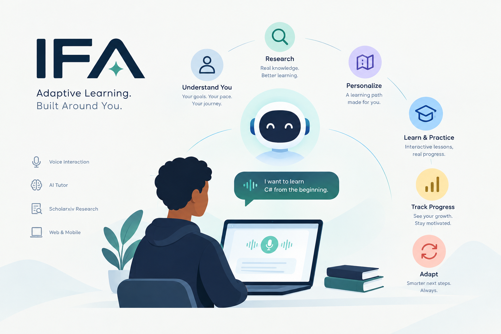

# IFA

> AI-powered adaptive learning companion that understands how you learn.

IFA is an AI-powered adaptive learning platform designed to help learners achieve different learning goals through personalized, research-driven learning experiences.

Whether someone is preparing for a national exam, a university exit exam, a professional certification, learning a new technical skill, or simply trying to understand a difficult subject, IFA adapts the learning experience around the learner rather than providing the same course to everyone.

IFA combines learner assessment, AI-powered research, personalized course generation, AI tutoring, voice interaction, quizzes, and progress analysis into one continuous learning loop.

---

## 🌍 Why IFA?

Most learning platforms provide predefined courses where every learner follows roughly the same path.

But learners do not start from the same place.

Two students studying the same subject may have completely different:

- Prior knowledge
- Strengths
- Weaknesses
- Learning goals
- Available study time
- Learning pace
- Areas that require additional practice

IFA aims to solve this problem by first understanding the learner and then building a learning experience around their needs.

Instead of:

```text
Choose Course → Watch Lessons → Take Quiz → Finish Course
```

IFA follows:

```text
Learner Goal
     ↓
Assessment
     ↓
Learner Profile
     ↓
Skill Gap Detection
     ↓
Research
     ↓
Personalized Learning Path
     ↓
AI Tutor
     ↓
Assessment
     ↓
Progress Analysis
     ↓
Adaptive Next Steps
     ↺
```

The learning experience continuously adapts as the learner progresses.

---

# 🎯 Problem

Learners often face several problems when trying to study effectively:

### 1. One-size-fits-all learning

Traditional online courses usually provide the same content and sequence to every learner.

### 2. Difficulty identifying knowledge gaps

Learners may know that they are struggling but not understand exactly which concepts they need to improve.

For example:

```text
Programming
├── C#              84%
├── REST APIs       78%
├── SQL             72%
├── JWT             39%   ← Weak area
├── Authorization   45%   ← Weak area
└── Testing         61%
```

### 3. Information is scattered

Learners often need to search through multiple websites, videos, articles, books, and papers before finding useful learning material.

### 4. AI tutors do not automatically create a complete learning journey

A chatbot can explain a topic, but simply asking questions to an AI does not necessarily create a structured learning path, measure progress, or adapt future learning.

### 5. Different learners have different goals

A student preparing for a national examination needs a different learning experience from:

* A university student preparing for an exit exam
* Someone preparing for a professional certification
* A developer learning a new technology
* A self-learner studying a new subject

IFA is designed around these differences.

---

# 💡 Solution

IFA creates a personalized learning experience based on each learner's goals, knowledge, weaknesses, and progress.

A learner can start by saying:

> "I want to prepare for my Grade 12 national exam."

or:

> "I'm preparing for my Computer Science exit exam."

or:

> "I want to learn C# from the beginning."

or:

> "I understand programming basics, but I'm struggling with SQL and APIs."

IFA uses this information to understand the learner's situation and generate an appropriate learning path.

---

# 🧠 Core Concept

IFA is built around five major capabilities:

### 1. Understand the learner

IFA collects information about the learner's:

* Goal
* Current knowledge
* Experience
* Strengths
* Weaknesses
* Available study time
* Preferred learning approach

### 2. Research

IFA can use research tools to find relevant and reliable information related to the learner's goal.

The research process is supported through **Scholarxiv** and its research capabilities.

### 3. Generate a personalized learning path

The research results and learner profile are used to generate:

* Courses
* Modules
* Lessons
* Learning objectives
* Examples
* Practice exercises
* Quizzes

### 4. Teach

IFA provides an AI tutor that can explain concepts, answer questions, provide examples, and guide learners through difficult topics.

### 5. Assess and adapt

After learning activities and quizzes, IFA analyzes the learner's performance and identifies what should happen next.

The system can recommend:

* Review topics
* Additional practice
* New lessons
* Difficult concepts to revisit
* Next modules
* Areas requiring improvement

---

# 🎙️ Voice-First Interaction

Voice interaction is a core part of IFA rather than simply an additional feature.

IFA uses **Voxide** to allow learners to interact with the application through voice.

For example:

```text
"Start my Physics course."
```

→ Opens the Physics course.

```text
"Show me my weak areas."
```

→ Opens the learner's skill profile.

```text
"Continue where I stopped."
```

→ Opens the learner's next recommended lesson.

```text
"Start the quiz."
```

→ Launches the relevant quiz.

```text
"How am I doing?"
```

→ Opens the learner's progress information.

```text
"Take me to Calculus."
```

→ Navigates to the Calculus learning area.

IFA is intended to support voice interaction in languages relevant to the platform, including supported Ethiopian languages where available.

### Voice architecture

```text
Learner
   ↓
Voice Input
   ↓
Voxide
   ↓
Intent Recognition
   ↓
IFA Backend
   ↓
Learning System
   ↓
Action / Response
```

Voice therefore becomes a way for learners to interact with the learning system itself.

---

# 🔬 Research-Driven Learning

IFA separates research from course generation.

Instead of asking an AI model to immediately generate an entire course, the system can first research the learning topic and then use the research results as input for course generation.

```text
Learner Goal
     ↓
Learning Assessment
     ↓
Research Agent
     ↓
Scholarxiv
     ↓
Relevant Research / Information
     ↓
Course Generation Agent
     ↓
Personalized Learning Path
```

This approach helps connect the generated learning experience to researched information instead of relying only on generic AI-generated content.

---

# 🤖 AI Agent Architecture

IFA is designed around specialized AI responsibilities.

## Learning Assessment Agent

Responsible for understanding the learner.

It identifies:

* Current knowledge
* Learning goals
* Strengths
* Weaknesses
* Learning requirements

---

## Research Agent

Responsible for researching information related to the learner's goal.

The Research Agent interacts with Scholarxiv and relevant research sources.

---

## Course Generation Agent

Uses:

* Learner profile
* Identified skill gaps
* Research results
* Learning goals

to generate a personalized learning structure.

---

## Tutor Agent

Acts as the learner's AI tutor.

It can:

* Explain concepts
* Answer questions
* Provide examples
* Give hints
* Simplify difficult topics
* Guide learners through lessons

---

## Assessment Agent

Evaluates learner performance using quizzes and learning activities.

It helps determine:

* What the learner understands
* What the learner is struggling with
* Whether the learner is ready to move forward
* What should be studied next

---

# 🔄 Adaptive Learning Loop

The core of IFA is a continuous feedback loop.

```text
┌──────────────────────┐
│    Learner Goal      │
└──────────┬───────────┘
           ↓
┌──────────────────────┐
│ Learner Assessment   │
└──────────┬───────────┘
           ↓
┌──────────────────────┐
│   Skill Gap Profile  │
└──────────┬───────────┘
           ↓
┌──────────────────────┐
│      Research        │
└──────────┬───────────┘
           ↓
┌──────────────────────┐
│ Personalized Course  │
└──────────┬───────────┘
           ↓
┌──────────────────────┐
│   Learn + AI Tutor   │
└──────────┬───────────┘
           ↓
┌──────────────────────┐
│      Assessment      │
└──────────┬───────────┘
           ↓
┌──────────────────────┐
│ Progress & Skill Gap │
│      Analysis        │
└──────────┬───────────┘
           ↓
      Next Learning Step
           │
           └──────────────↺
```

This creates a personalized learning cycle rather than a static course.

---

# 🏗️ System Architecture

The initial architecture follows a Clean/Onion Architecture approach.

```text
                    ┌─────────────────────┐
                    │   SvelteKit Client  │
                    │                     │
                    │ Web Application     │
                    └──────────┬──────────┘
                               │
                               ▼
                    ┌─────────────────────┐
                    │    ASP.NET Core     │
                    │         API         │
                    └──────────┬──────────┘
                               │
             ┌─────────────────┼─────────────────┐
             │                 │                 │
             ▼                 ▼                 ▼
     ┌───────────────┐ ┌───────────────┐ ┌───────────────┐
     │ Learning      │ │ AI Services   │ │ Research      │
     │ Services      │ │               │ │ Service       │
     └───────────────┘ └───────────────┘ └───────┬───────┘
                                                 │
                                                 ▼
                                         ┌───────────────┐
                                         │   Scholarxiv  │
                                         └───────────────┘

                               │
                               ▼
                    ┌─────────────────────┐
                    │     PostgreSQL      │
                    │      Database       │
                    └─────────────────────┘
```

---

# 🧱 Backend Architecture

The backend follows a layered Clean/Onion Architecture.

```text
IFA
│
└── src
    │
    ├── IFA.Domain
    │
    ├── IFA.Application
    │
    ├── IFA.Infrastructure
    │
    └── IFA.API
```

### Domain

Contains the core business entities and rules.

Examples:

* Learner
* Course
* Module
* Lesson
* Quiz
* Question
* Skill
* LearningGoal
* Progress

### Application

Contains application use cases and business workflows.

Examples:

* Create learner profile
* Analyze skill gaps
* Generate learning path
* Generate quiz
* Update progress
* Recommend next lesson

### Infrastructure

Contains external implementations such as:

* Database access
* Entity Framework Core
* AI providers
* Scholarxiv integration
* Voxide integration
* External services

### API

Provides HTTP endpoints used by the SvelteKit frontend.

---

# 🛠️ Technology Stack

## Frontend

* SvelteKit 2 (Svelte 5)
* TypeScript
* HTML
* Tailwind CSS

## Backend

* C#
* ASP.NET Core
* Entity Framework Core
* Clean/Onion Architecture

## Database

* PostgreSQL

## AI

* Large Language Models
* AI-powered learning agents
* AI tutoring
* AI assessment
* AI course generation

## Research

* Scholarxiv
* Scholarxiv MCP
* Papers API

## Voice

* Voxide

## Development

* Git
* GitHub
* Docker

## Deployment

* EthioDeploy

---

# ☁️ Deployment

IFA is planned to be deployed using **EthioDeploy**.

The intended deployment architecture is:

```text
                    Internet
                       │
                       ▼
              ┌─────────────────┐
              │   IFA Frontend  │
              │   SvelteKit     │
              └────────┬────────┘
                       │
                       ▼
              ┌─────────────────┐
              │   IFA Backend   │
              │ ASP.NET Core    │
              └───────┬─────────┘
                      │
          ┌───────────┼────────────┐
          │           │            │
          ▼           ▼            ▼
     PostgreSQL      AI       Scholarxiv
                               
                       │
                       ▼
                    Voxide
```

---

# 📱 Example User Journey

### Step 1 — Set a goal

The learner says:

> "I want to prepare for my Computer Science exit exam."

They can use text or voice.

---

### Step 2 — Assessment

IFA asks questions to understand the learner's current knowledge.

---

### Step 3 — Learner profile

IFA creates a profile showing areas of strength and weakness.

Example:

```text
Computer Science

Programming       82%
Data Structures   74%
Algorithms        61%
Databases         53%
Operating Systems 47%
Networks          39%
```

---

### Step 4 — Research

IFA researches relevant topics and learning material.

---

### Step 5 — Personalized course

IFA generates a learning path based on the learner's weaknesses.

Example:

```text
Computer Science Exit Exam Preparation

Module 1 — Computer Networks
Module 2 — Operating Systems
Module 3 — Database Systems
Module 4 — Algorithms
Module 5 — Practice & Revision
```

---

### Step 6 — Learn

The learner studies through lessons and interacts with the AI tutor.

---

### Step 7 — Assessment

The learner completes quizzes and exercises.

---

### Step 8 — Adaptation

IFA analyzes the results.

For example:

```text
Database Systems
Before: 53%
After: 71%

Recommended:
→ Review SQL joins
→ Practice normalization
→ Continue to transactions
```

The next learning step is therefore based on the learner's actual performance.

---

# 🎓 Target Users

IFA is designed for a broad range of learners.

### Students

* Grade 12 national examination preparation
* University exit examination preparation
* University coursework
* Subject revision

### Professional Learners

* Certification preparation
* Technical examinations
* Career development
* Skill improvement

### Self-Learners

* Learning programming
* Learning languages
* Learning technical subjects
* Exploring new fields
* Improving existing skills

IFA is not limited to one examination, school level, or academic department.

---

# 🚀 MVP

The initial MVP focuses on demonstrating the complete adaptive learning loop.

### Core Features

* [ ] AI-powered onboarding
* [ ] Text-based learner assessment
* [ ] Voice-based interaction
* [ ] Learner profile generation
* [ ] Skill gap identification
* [ ] Scholarxiv research integration
* [ ] AI-generated learning path
* [ ] AI-generated course modules
* [ ] AI tutor
* [ ] Voice-driven application interaction
* [ ] Quiz generation
* [ ] Quiz evaluation
* [ ] Progress tracking
* [ ] Adaptive recommendations

### Demo Goal

The MVP should demonstrate one complete journey:

```text
Goal
 ↓
Assessment
 ↓
Skill Profile
 ↓
Research
 ↓
Course Generation
 ↓
Learning
 ↓
AI Tutor
 ↓
Quiz
 ↓
Progress Analysis
 ↓
Next Recommendation
```

Rather than building many disconnected features, the focus is on making this complete loop work.

---

# 🧪 Example Demo Scenario

A learner starts IFA and says:

> "I want to learn C# for backend development."

IFA then:

1. Understands the learner's current experience.
2. Identifies knowledge gaps.
3. Builds a learner profile.
4. Researches relevant concepts.
5. Generates a personalized learning path.
6. Creates lessons.
7. Provides an AI tutor.
8. Gives quizzes.
9. Analyzes quiz results.
10. Recommends what the learner should study next.

The same system can then be used for different learning goals.

---

# 📊 What Makes IFA Different?

IFA is not designed to be another traditional LMS with an AI chatbot added to it.

The key difference is the relationship between the learner profile, research, course generation, tutoring, and assessment.

```text
Traditional LMS

Predefined Course
       ↓
   Learner
       ↓
   Assessment
```

```text
IFA

Learner
   ↓
Understand Learner
   ↓
Identify Skill Gaps
   ↓
Research
   ↓
Generate Personalized Path
   ↓
Teach
   ↓
Assess
   ↓
Analyze
   ↓
Adapt
   ↺
```

The system is designed around the learner rather than around a predefined course.

---

# 🔐 Data & Privacy

IFA is designed with learner data in mind.

Potentially sensitive learner information should be handled carefully, including:

* Learning progress
* Assessment results
* Learning goals
* Generated learner profiles

The system should follow appropriate security practices for authentication, authorization, API communication, and database access.

---

# 🧑‍💻 Development Principles

IFA is being developed with the following principles:

### Build from scratch

The project is being developed during the official hackathon period.

### Keep development traceable

Development progress is recorded through:

* GitHub commits
* GitHub history
* STARK Changelog
* Scholarxiv research and ideation documentation

### Build the MVP first

The team prioritizes a working end-to-end learning loop before adding secondary features.

### Separate responsibilities

The backend uses Clean/Onion Architecture to keep business logic independent from infrastructure concerns.

### Research before implementation

Major product decisions should be supported by research where appropriate.

---

# 📝 Hackathon Documentation

IFA is being developed for the **STARK Official Hackathon 2026**.

The project follows the hackathon's required workflow.

### Scholarxiv

Used to document:

* Problem research
* Existing solutions
* Research findings
* Identified gaps
* Product ideas
* Evolution of the concept
* Evidence behind design decisions

### STARK Changelog

Used to document development progress during the hackathon.

Entries live in [`docs/stark-changelog.md`](docs/stark-changelog.md), are appended
with `npm run changelog:add`, and are validated with `npm run changelog:verify`.

Examples:

* Architecture decisions
* Features implemented
* Major changes
* Technical decisions
* Problems encountered
* Solutions implemented

### GitHub

Used for:

* Source code
* Version control
* Collaboration
* Commit history
* Development history

### Voxide

Used for meaningful voice interaction with the application.

### EthioDeploy

Planned for deployment.

---

# 📅 Development Roadmap

## Phase 1 — Foundation

* Project repository
* Backend architecture
* SvelteKit application
* Database
* Authentication
* Initial domain models

## Phase 2 — Learner Understanding

* Learner onboarding
* Goal collection
* Initial assessment
* Skill profile
* Skill gap analysis

## Phase 3 — Research & Generation

* Scholarxiv integration
* Research service
* Course generation
* Learning path generation

## Phase 4 — Learning Experience

* Course interface
* Lessons
* AI tutor
* Voice interaction
* Quiz system

## Phase 5 — Adaptation

* Progress tracking
* Assessment analysis
* Weak-area detection
* Personalized recommendations

## Phase 6 — Deployment & Demo

* Production configuration
* Deployment
* Testing
* Bug fixing
* Demo preparation
* Pitch preparation

---

# 📁 Project Structure

The planned repository structure is:

```text
IFA/
│
├── src/
│   ├── IFA.Domain/
│   ├── IFA.Application/
│   ├── IFA.Infrastructure/
│   └── IFA.API/
│
├── client/                     # SvelteKit 2 web client
│   ├── src/
│   └── package.json
│
├── tests/                      # planned unit and integration tests
│   ├── IFA.UnitTests/
│   └── IFA.IntegrationTests/
│
├── docs/
│   ├── architecture/
│   ├── research/
│   ├── design/
│   └── stark-changelog.md
│
├── scripts/                    # STARK changelog automation
│
├── docker/                     # Dockerfiles for the API and web client
│
├── docker-compose.yml
├── .gitignore
├── README.md
└── LICENSE
```

The structure may evolve as implementation progresses.

---

# 🤝 Team

**Team XOR**

IFA is developed by Team XOR for the STARK Official Hackathon 2026.

### Team Members

* **Nathnel Teklemariam** — Team Lead
* **Ermiyas Eshetu**
* **Negede Tekleyes**

---

# 🔥 Hackathon Focus

The goal is not simply to build a collection of AI features.

The goal is to demonstrate a complete and useful learning experience:

> **Understand the learner → Research → Personalize → Teach → Assess → Adapt**

The team is focusing on building a working MVP under the hackathon time constraints while keeping the development process documented and traceable.

---

# 📌 Current Status

**Status:** 🚧 In Development

IFA is currently being developed as part of the STARK Official Hackathon 2026.

The project is actively evolving based on:

* Team research
* User needs
* Technical feasibility
* Hackathon requirements
* Development feedback

### Phase 1 — Foundation (complete)

* SvelteKit 2 client shell with the IFA design system and dashboard components
* ASP.NET Core Clean Architecture solution (`Domain`, `Application`, `Infrastructure`, `API`)
* EF Core + PostgreSQL persistence with entity configurations and an initial migration
* Swagger, a SvelteKit-scoped CORS policy, and a `/api/health` endpoint
* STARK changelog automation (`npm run changelog:verify`) and a local `docker-compose.yml`

---

# 🗺️ Future Possibilities

After the MVP, IFA could be expanded with:

* More Ethiopian language support
* Amharic and Afaan Oromo learning experiences
* More examination-specific preparation
* Institutional learning support
* Teacher/instructor tools
* Learning analytics
* More advanced skill graphs
* Offline/low-bandwidth learning
* Mobile applications
* Educational content partnerships
* More research sources
* Personalized study schedules

These features are outside the initial MVP unless development time allows them.

---

# 📜 License

This project is currently developed as part of the STARK Official Hackathon 2026.

License information will be added as the project reaches a release stage.

---

# ⭐ Vision

IFA's long-term vision is to make personalized learning more accessible by giving every learner an intelligent learning companion that understands where they are, where they want to go, and what they need to learn next.

> **Don't give every learner the same path. Build the path around the learner.**

---

## Built with ❤️ by Team XOR

**IFA — Adaptive learning built around you.**
